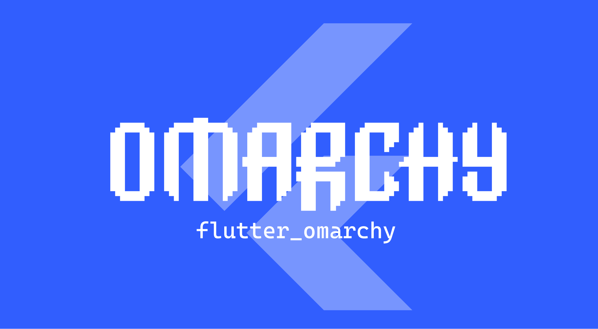
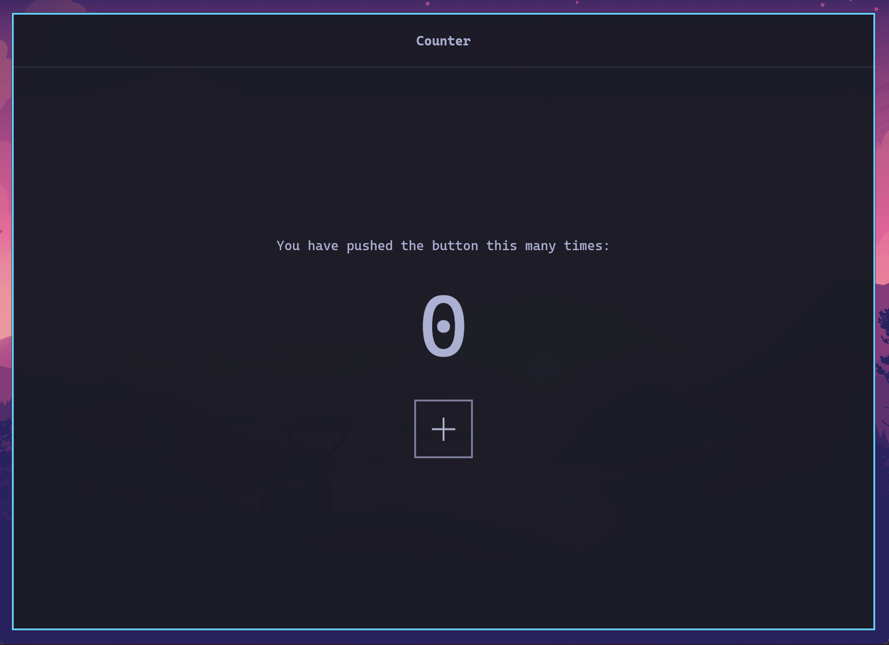
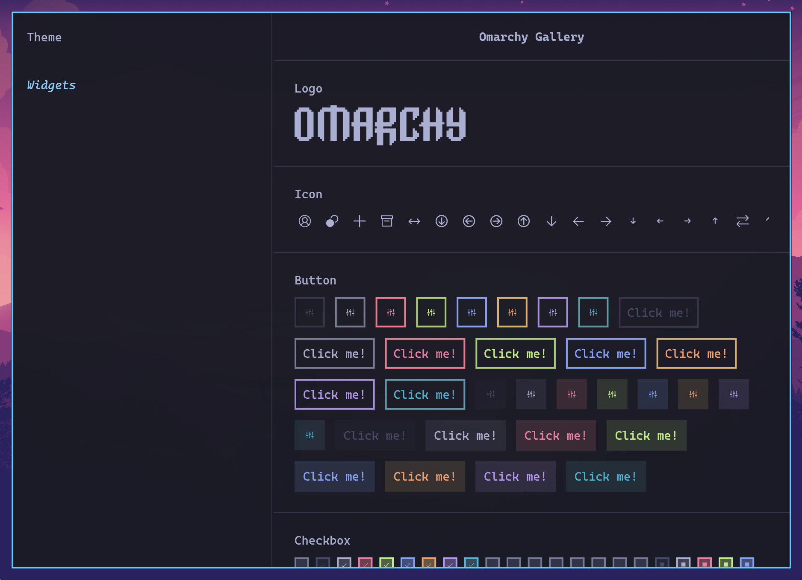
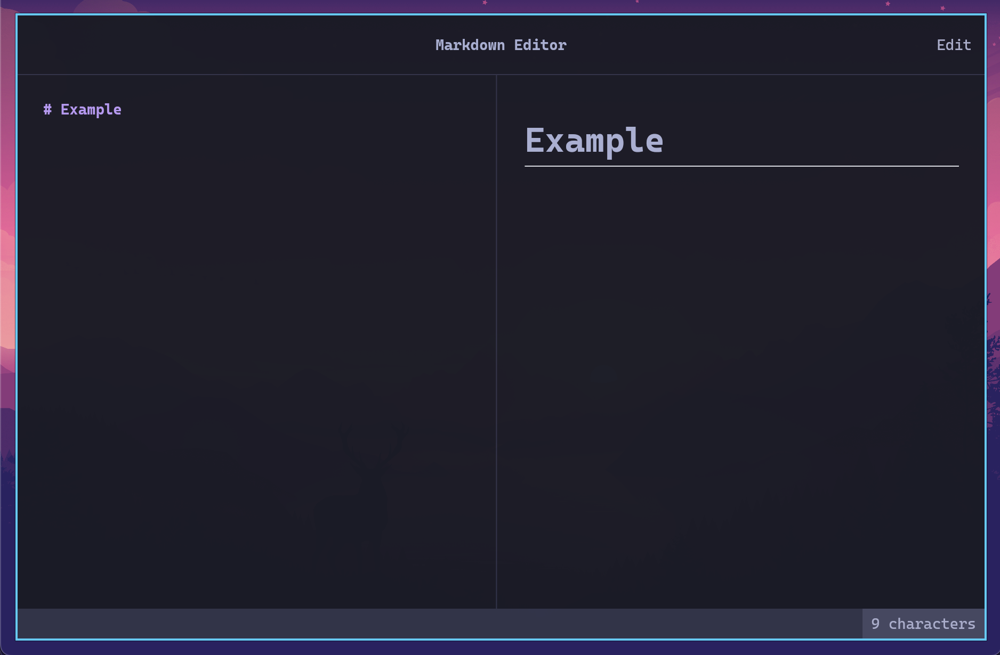
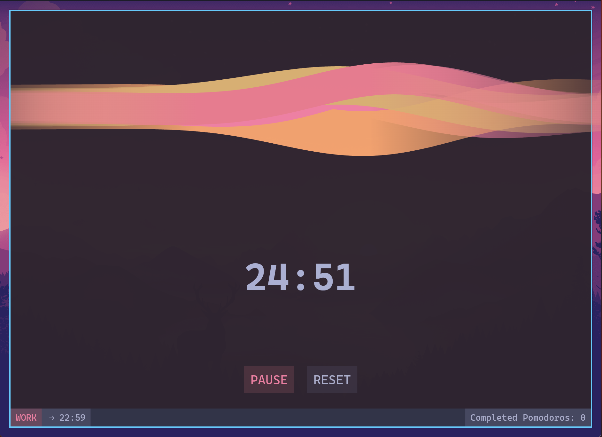

[](https://pub.dev/packages/flutter_omarchy)
[](https://github.com/aloisdeniel/flutter_omarchy)
[](https://opensource.org/licenses/MIT)

A Flutter package for developing applications for [Omarchy](https://omarchy.org).

> **⚠️ DISCLAIMER:** This package is in a very early development stage. The API is unstable and may change significantly without notice. Use at your own risk in production applications.

## Introduction

Flutter Omarchy is a specialized UI toolkit designed for building applications that seamlessly integrate with the [Omarchy](https://omarchy.org) Archlinux configuration created by [DHH](https://x.com/dhh). This package bridges the gap between Flutter's powerful development capabilities and the minimalist, terminal-inspired aesthetic of the Omarchy system. 

## Quickstart

### Installation

Add Flutter Omarchy to your `pubspec.yaml`:

```bash
flutter pub add flutter_omarchy
```

### Basic Usage

```dart
import 'package:flutter_omarchy/flutter_omarchy.dart';

Future<void> main() async {
  await Omarchy.initialize(); // This is required to load fonts
  runApp(MyApp());
}

class MyApp extends StatelessWidget {
  @override
  Widget build(BuildContext context) {
    return OmarchyApp(
      home: OmarchyScaffold(
        body: Center(
          child: OmarchyButton(
            onPressed: () {},
            child: Text('Hello Omarchy!'),
          ),
        ),
      ),
    );
  }
}
```

## Usage

### App Structure

The `OmarchyApp` widget is the root of your application:

```dart
OmarchyApp(
  home: MyHomePage(),
)
```

### Theming

Flutter Omarchy automatically adapts to the system theme of the Omarchy environment and respond to system-wide theme changes without additional configuration.

Flutter Omarchy extracts its theme from the Alacritty terminal configuration and Walker CSS files, just as the Omarchy system does. Since Omarchy doesn't have a dedicated theme configuration, the package reads:

- **Alacritty Configuration**: Located at `~/.config/alacritty/alacritty.toml`, this file provides the terminal colors and styling.
- **Walker CSS**: Located at `~/.config/omarchy/current/theme/walker.css`, this file contains additional color definitions.

The package automatically observes these configuration files for changes. When you modify your Alacritty or Walker configurations, the theme updates in real-time across all Flutter Omarchy applications without requiring a restart.

You can access the current theme in your application using:


```dart
final theme = OmarchyTheme.of(context);
final red = theme.colors.normal.red; // Alacritty normal terminal color (background)
final brightRed = theme.colors.bright.red; // Alacritty bright terminal color (foreground)
final border = theme.colors.border; // The walker border color
final body = theme.text.normal.copyWith(color: red); // The text style
```

### Widgets

Omarchy provides a rich set of widgets:

#### Basic Widgets

- `OmarchyButton`: Terminal-style button
- `OmarchyTextInput`: Text input field
- `OmarchyCheckbox`: Checkbox component
- `OmarchyTile`: List tile component

#### Navigation

- `OmarchyScaffold`: Main layout container
- `OmarchyNavigationBar`: Side navigation bar
- `OmarchyTabs`: Tabbed interface
- `OmarchyStatusBar`: Status bar for displaying app state

#### Layout

- `OmarchyDivider`: Horizontal or vertical divider
- `OmarchyResizeDivider`: Resizable divider for split views

#### Utility

- `OmarchyTooltip`: Tooltip component
- `OmarchyPopOver`: Popup overlay

## Bundling the app for Omarchy

To bundle and run your Flutter Omarchy application on Linux, follow these steps:

### Building the Linux Bundle

1. Make sure you have the required Linux dependencies installed:
   ```bash
   sudo pacman -Syu --needed xz glu
   sudo pacman -S --needed clang cmake ninja pkgconf gtk3 xz gcc
   
   mise plugins install flutter https://github.com/mise-plugins/mise-flutter.git
   mise use -g flutter@latest
   ```

2. Build the release version of your application:
   ```bash
   flutter build linux --release
   ```

3. The bundled application will be available in the `build/linux/x64/release/bundle/` directory.

### Running the Application

You can run the bundled application directly:
```bash
cd build/linux/x64/release/bundle/
./your_app_name
```

## Running on other platforms *(Windows, macOS, Android, iOS, Web)*

Flutter Omarchy is a pure Flutter package, making it compatible with all Flutter-supported platforms including Windows, macOS, Android, iOS, and Web. If the Omarchy configuration files aren't found on these platforms, the theme automatically falls back to the Tokyonight theme, ensuring a consistent visual experience.

While the package should run without issues on all platforms, please note that our primary focus is on the Omarchy Linux platform. Some features may not be fully tested on other platforms, and platform-specific optimizations might be limited. We welcome feedback and contributions to improve cross-platform compatibility.

## Example

The package includes several example applications. 

Note that these examples are just basic showcases for components, and the logic behind them might be incomplete or not suitable for production use. They're designed to demonstrate the visual appearance and basic functionality of the Omarchy widgets rather than provide complete application solutions.

To run one of the example application from Omarchy:

```bash
cd example
flutter run --app=pomodoro
```

### Counter



[View in browser](https://aloisdeniel.github.io/flutter_omarchy/?app=counter) | [Code](example/lib/counter.dart)

### Gallery



[View in browser](https://aloisdeniel.github.io/flutter_omarchy/?app=gallery) | [Code](example/lib/gallery.dart)

### File Explorer


[View in browser](https://aloisdeniel.github.io/flutter_omarchy/?app=file_explorer) | [Code](example/lib/pomodoro.dart)

### Markdown Editor



[View in browser](https://aloisdeniel.github.io/flutter_omarchy/?app=markdown_editor) | [Code](example/lib/markdown_editor.dart)

### Pomodoro



[View in browser](https://aloisdeniel.github.io/flutter_omarchy/?app=pomodoro) | [Code](example/lib/pomodoro.dart)

## Roadmap & Ideas

* Vim motions in text inputs
* Simplified application wide shortcuts configuration
* Preconfigured HJKL shortcuts for navigation
* Specific ormarchy theme configuration (colors, hide nav bar, ...)
* Widgets 
  * Toasts
  * Progress
  * Skeleton
* Examples
  * Todo list
  * AI Chat
  * World clocks
  * Podcast player
  * QRCode generator
  * Password manager
  * Contact book
  * Drawing pad (drawing + text)
  * Raycast-like launcher
  * Calendar
  * Notes app

## How to Contribute

Contributions are welcome! Here's how you can help:

1. **Fork the Repository**: Create your own fork of the project
2. **Create a Branch**: Make your changes in a new branch
3. **Submit a Pull Request**: Open a PR with a clear description of your changes
